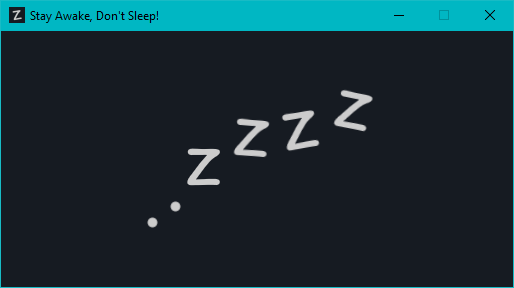

# "Stay Awake, Don't Sleep!" utility (in Python) 

## Background
"Stay Awake, Don't Sleep!" is a small Python utility designed to keep a machine/workstation from going idle. Leveraging the awesome PyAutoGUI library to impersonate a human being and programmatically control the keyboard, this utility presses the scroll lock key ~2 times a second.

I built this tool to solve a problem, learn about ```tkinter```, ```pyautogui``` and python ```threading```. Displaying a basic GUI while a second thread takes care of the automation. Interestingly I always press the scroll lock key twice, this means if you started the utility, came back to your machine 30 minutes later and closes it, the "even" number of presses means your scroll lock "state" would be the same as before you left!

## Usage
The App starts in the system tray (with the  icon).


A right-click context menu allowing you to "```Show```" the main GUI  (below) or "```Quit```" and close the application. The GUI close cross again minimises to the system tray.



Why you want to use this application for yourself? for? I have no idea!

## Install Guide (using _chololatey_)
Python, PIP and PyAutoGUI
```powershell
# install python using chocolatey
choco install python -y
# install pip using python
python -m pip install --trusted-host pypi.python.org --trusted-host files.pythonhosted.org --trusted-host pypi.org --upgrade pip
# install pyautogui using pip
python -m pip install --trusted-host pypi.python.org --trusted-host files.pythonhosted.org --trusted-host pypi.org --upgrade pyautogui
# install pylance using pip
python -m pip install --trusted-host pypi.python.org --trusted-host files.pythonhosted.org --trusted-host pypi.org --upgrade pylance
# run awake.pyw
py ./awake.pyw
```

## Known Issues
- Automatically pressing the scroll lock whilst trying to drag (& drop) in Windows causes the action to stop fail, resulting in unwanted behaviour when selecting or moving objects
